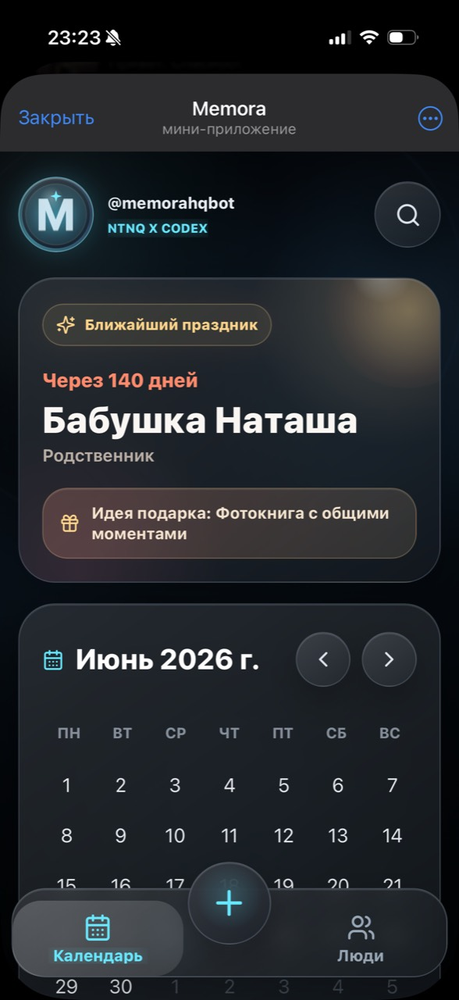
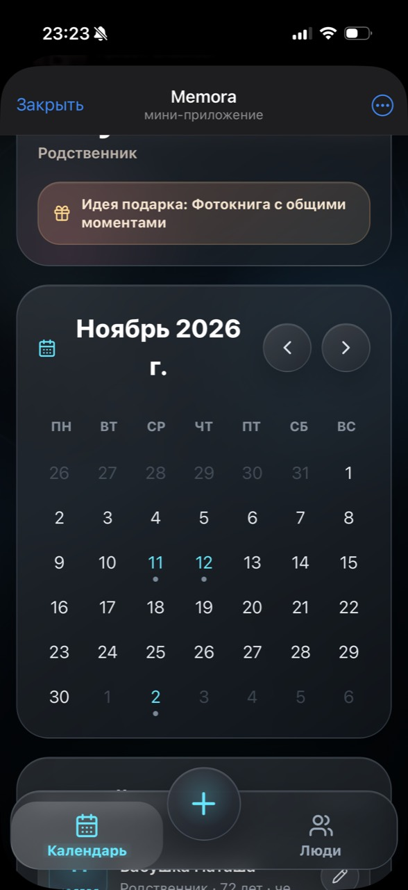
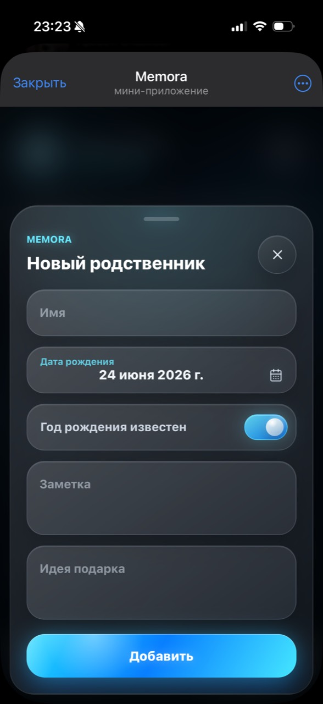

# Memora Birthday Bot

Telegram bot and Telegram Mini App for storing family birthdays and sending reminders.

The project is an MVP of a small personal productivity service: a user opens the Mini App from Telegram, adds relatives and important dates, and receives a Telegram reminder on the birthday date.

## Why this project exists

Memora was built as a practical full-stack project with a real user flow, not only as a code example. It combines a Telegram bot, web interface, backend API, PostgreSQL database, scheduled jobs, environment configuration, and deployment notes.

## Tech Stack

- Frontend: React, Vite, TypeScript, Tailwind CSS
- Backend: Node.js, TypeScript, Express
- Telegram: Telegraf, Telegram Mini App
- Database: PostgreSQL, Neon-ready configuration
- Scheduler: node-cron
- Runtime and deploy: Render, PM2, GitHub Actions

## Features

- `/start`, `/help`, and `/app` commands in the Telegram bot
- Telegram Mini App launch button and menu button
- Telegram WebApp `initData` verification on the backend
- User-specific data isolation by Telegram user id
- REST API for birthdays:
  - `GET /api/me`
  - `GET /api/birthdays`
  - `POST /api/birthdays`
  - `PUT /api/birthdays/:id`
  - `DELETE /api/birthdays/:id`
- Add, edit, and delete birthday records
- Monthly calendar view
- Upcoming birthdays list
- Optional notes and gift ideas
- Daily cron check and Telegram reminders
- `sent_reminders` table to avoid duplicate reminders for the same day
- Health check endpoint for hosting platforms

## Project Structure

```text
apps/
  api/
    src/
      index.ts              # Express API, static Mini App serving, bot startup, scheduler startup
      bot.ts                # Telegram bot commands and Mini App buttons
      routes.ts             # REST API routes and validation
      db.ts                 # PostgreSQL connection, schema migration, user upsert
      telegramAuth.ts       # Telegram WebApp initData verification
      authMiddleware.ts     # Request authentication through Telegram initData
      scheduler.ts          # Daily birthday reminder scheduler
      birthdayUtils.ts      # Date helpers and sorting logic
      seed.ts               # Demo data
  web/
    src/
      App.tsx               # Main Mini App interface
      api.ts                # Backend API client
      telegram.ts           # Telegram WebApp helpers
      date.ts               # Calendar and birthday date helpers
      types.ts              # Shared frontend types
```

## Architecture

```text
Telegram User
    |
    v
Telegram Bot (Telegraf)
    |
    | opens
    v
React Telegram Mini App
    |
    | Authorization: tma <initData>
    v
Express API
    |
    v
PostgreSQL / Neon

node-cron -> Express backend -> Telegram reminder message
```

More details: [docs/architecture.md](docs/architecture.md)

## Local Development

Requirements:

- Node.js 22.x or newer
- npm
- Telegram bot token from BotFather
- PostgreSQL connection string, for example from Neon

Copy the environment example:

```bash
copy .env.example .env
```

Install dependencies:

```bash
npm install
```

Seed demo data when needed:

```bash
npm run seed
```

Run API and frontend in development mode:

```bash
npm run dev
```

Default local URLs:

- API: `http://localhost:3000`
- Web Mini App frontend: `http://localhost:5173`

Full setup guide: [docs/setup.md](docs/setup.md)

## Deployment

The repository contains deployment configuration for two scenarios:

- Render + Neon for a simple hosted MVP
- PM2 + GitHub Actions for deployment to a custom server

Deployment notes: [docs/deploy.md](docs/deploy.md)

## Environment Variables

See [.env.example](.env.example).

Important variables:

- `BOT_TOKEN` - Telegram bot token from BotFather
- `WEB_APP_URL` - public HTTPS URL of the Mini App
- `DATABASE_URL` - PostgreSQL connection string
- `REMINDER_CRON` - reminder schedule in cron format
- `TIMEZONE` - scheduler timezone

## Security Notes

- Secrets are not committed to the repository.
- Telegram Mini App requests are authenticated through signed `initData`.
- Birthday records are filtered by backend user id, not by a client-provided user id.
- Duplicate daily reminders are prevented through the `sent_reminders` table.

## Portfolio Notes

This project demonstrates:

- building a Telegram bot and Mini App flow;
- connecting frontend, backend, database, and scheduled jobs;
- working with environment variables and deployment configuration;
- documenting setup and production usage;
- preparing a small product-style MVP from idea to runnable application.

## Screenshots

| Main screen | Calendar | Add relative |
| --- | --- | --- |
|  |  |  |
